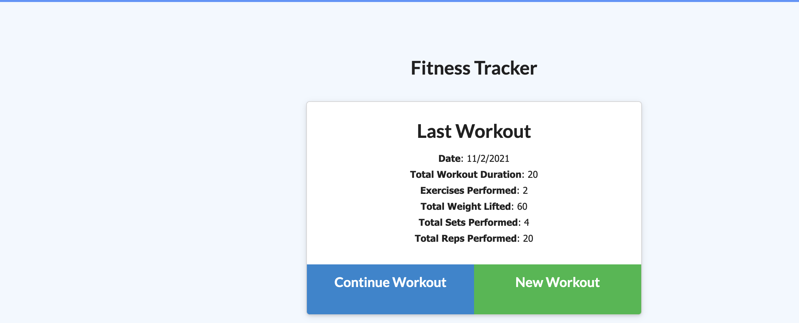

# fitness-tracker

## Description
This is a fitness tracker. You can add several exercises to a given workout regime, and you can track your workout stats.  

## Table of Contents 
- [Installation](#installation)
- [Usage](#usage)
- [License](#license)
- [Contributing](#contributing)
- [Tests](#tests)
- [Questions](#questions)

## Installation
You can install the project here: https://github.com/jfisher37/fitness-tracker

## Usage
Please refer to the pictures below for instructions on how to use the project. 

On the homepage, you can see details of your previous workout, add an exercise to the workout, or create a whole new workout.

The dashboard shows you your workout stats:
   
   

You can add an exercise according to the options provided on the add exercise page. 
   
   

## License
This project is covered by a MIT license.

## Contributing
If you want to make contributions, please refer to the following instructions:

If you'd like to contribute to the project, please refer to the contact info in the Questions section below. 

## Tests
If you'd like to test the project, please refer to the contact info in the Questions section below. 

## Questions
Please refer to the below contact information for any questions:

Github Profile - jfisher37

Github Profile Link - https://github.com/jfisher37

Email - joseph.eric.fisher@gmail.com

